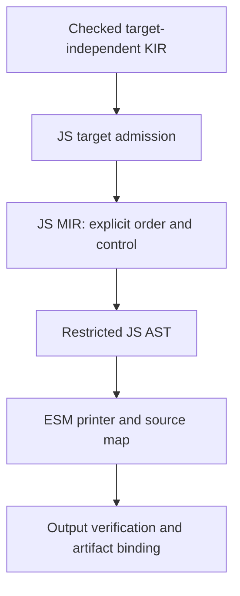

# Kotoba → JavaScript backend: 実装調査と最小パッチ

調査日: 2026-09-09。結論: backend は新設しない。既存 `kotoba-script`
を段階的に分割し、意味論の差を測ってから lowering を変える。
この文書の「提案」は未実装。今回の実装は fuel admission と実行テストに限定する。

## 調査対象と再現性

公開 main の独立 checkout を調査した。CLI の release と依存 pin を揃えた
release qualification ではない。以下の SHA を混同しない。

| Repository | 調査 SHA | 責務・読んだ実装 |
|---|---|---|
| kotoba | e9d3c7e659bea5a41581b98337b78d281ab8866b | `deps.edn`, `src/kotoba/launcher.clj`, launcher/language-conformance tests |
| amu | 3ef1a709f01a672b451981de42022158fe23d1e5 | `compiler/core.clj`, `nbb/js_cli.cljs`, `backend/cljs.cljc`, `lang_conformance.clj`, `project.cljc` |
| kotoba-script | 12a47791d1614ebf919ff8bac4c9039fa9f72e70 | `src/kotoba/script.cljk`, JVM suite, nbb parity fixtures |
| kotoba-kir | 8085b60354041752aaab7a7d0f131eab94c9d44a | `kir.cljc`: execute, invoke-function, eval-expr, max-fuel |
| kotoba-wasm | e96234167555136c1d1bb3ac9a09b8116fa5f9de | `wasm/core.cljc`: emit, fuel-budget!, capability imports; `typed.cljc` |
| kotoba-hir | ac8e70514ee3c9b87ae71324e6e714447acc971c | HIR schema and required function metadata |
| text | 73bdb13ae7a3d004b44bca08be03a3191157a38f | portable emitter string dependency |
| org-nist-sha2 | becdf25da4a108df310fb3e1e9db094492b6e34b | KIR evaluator の portable dependency |

サイトの説明よりコードを優先した。`kotoba compile` の web 経路は既に
`:js-kotoba-v1` / `:kotoba-script` / `.mjs` へ接続される。
`amu/core.clj` は checked KIR、source/KIR digest、解決済み fuel を `script/emit`
へ渡し、output digest と manifest を構築する。`backend/cljs.cljc` と
`:cljs-kotoba-v1` は別経路であり、restricted ESM の代わりに使わない。

`script.cljc` は文字列 emitter と型検証・ABI runtime が同居する。
JVM では Closure Compiler AST、nbb では Node syntax check と token scan が
出力を検査する。後者は前者と同等の構文解析・証明ではない。
KIR の format tag だけで checked と信頼する設計にもしてはいけない。
公開 compiler admission と backend の defensive validation を両方残す。

## 先行実装から借りるもの

- [Parenscript reference](https://parenscript.common-lisp.dev/reference.html):
  Lisp form から JS の expression/statement を組み立てる小ささを参考にする。
  Common Lisp macro 実行や JS の暗黙変換を Kotoba に持ち込む根拠にはしない。
- [Gambit universal backend](https://github.com/gambit/gambit/blob/master/gsc/_t-univ-2.scm):
  実装中の trampoline runtime と継続先を返す制御を参考にする。
  Kotoba にない continuations、動的 Scheme runtime 全体は導入しない。
- [ClojureScript compiler](https://github.com/clojure/clojurescript/blob/master/src/main/clojure/cljs/compiler.cljc):
  analyzer と `emit* :op`、生成位置/source-map bookkeeping の分離を参考にする。
  「ClojureScript は独立 JS AST が必須」という理解は誤り。現行 emitter は
  analysis AST から文字列を書き出す。[2012年の JS AST 文書](https://archive.clojure.org/design-wiki/display/design/JavaScript%2BAST.html)
  は提案であり、現行実装の証明ではない。

## Lowering architecture

推奨パイプライン:



KIR の canonical bytes、DefCID、effect row、closure metadata を変更しない。
JS の名前、loop label、runtime helper ID、生成位置は KIR の外側に置く。
target が未対応の op/type/effect を見たら emitter 前に拒否する。

JS MIR は独立レイヤーとして置く価値がある。ただし汎用 SSA compiler を
新設しない。最初は typed ANF と structured control の小さな内部データにする。
値は temp/binding ID で参照し、命令は const, bind, primitive, call,
cap-call, validate, charge、終端は return, branch, self-tail-call とする。
`origin` は source span と KIR node path を side table で参照する。
副作用だけでなく trap と fuel も順序依存なので、pure に見える演算でも
may-trap を消去・移動する最適化は別途証明が必要。

独立 JS AST も推奨するが、当初は printer の許可リストに絞る。
必要なのは Identifier/Literal/Call/Block/VariableDeclaration/If/While/
Continue/Return/Throw/Function/Export など。raw JS escape、任意の property
access、dynamic import、eval を guest node に持たせない。
runtime 専用 node と guest lowering を区別し、runtime helper 呼出も ID で管理する。
AST の導入だけでは安全性は証明されないため、生成後 verifier も残す。

移行先の候補 namespace:

| Namespace | 既存コードから移す責務 |
|---|---|
| `kotoba.script.admission` | validate-types!, capabilities/exports/fuel validation |
| `kotoba.script.mir` | infer-type の結果、binding ID、emit-tail の制御・評価順序 |
| `kotoba.script.js-ast` | restricted node constructors / structural verifier |
| `kotoba.script.runtime` | helper registry、依存関係、ABI profile |
| `kotoba.script.print` | 名前生成、escaping、ESM、位置計測 |
| `kotoba.script` | 既存 `emit` API を保つ facade |

一度に置換しない。最初は `let/if/do/self-tail-call` だけ MIR/AST 化し、
実行差分を通す。残る primitive emitter は移行中だけ内部 adapter で接続する。
source/KIR digest は不変でも、生成バイトが変われば artifact digest は変わる。

## 値と制御の表現

| 論点 | 現状と採用方針 |
|---|---|
| closure | closed-module dispatcher + lambda ID/capture pair chain。現行 assertClosure と refinement metadata を保持。JS Function や任意 host object を guest closure として受け入れない。capture 数・型・provenance を admission で確認する。 |
| recursion | 通常 call は静的関数 ID へ。JS engine の host stack を言語上の深さ保証にしない。非末尾再帰は現状の限界を記録し、将来必要なら explicit frame machine。 |
| self tail call | 現行 emit-tail は引数を全て一時変数へ評価した後で parameter を更新。`f(b,a)` の swap と let shadowing を維持。guard と charge の位置も観測可能。 |
| mutual/indirect tail call | 未実装の一般 PTC を宣言しない。tail-call graph の SCC 内 trampoline を次段階で導入。非末尾 call は trampoline driver の結果を値として受け取る。marker を言語値に混入させない。 |
| i64/i32 | i64 は BigInt + asIntN(64)。Number に狭めない。quot はゼロ除算と MIN/-1 overflow を明示 trap。i32 profile は幅を明示して wrap/shift。 |
| f32/f64 | Number + f32 の明示 rounding。NaN canonicalization、±0、Infinity、bit conversion、checked/lossy conversion を既存 helper に従わせる。Math の都合で transcendental domain を広げない。 |
| collections | descriptor 付き immutable canonical values と bounded validators。Array/Map/Set は実装用。JS insertion order、identity、prototype を言語仕様にしない。ABI 境界でコピー・検証し、上限を守る。 |
| equality | 型別 scalar equality と descriptor-aware structural equality。f64 ordered/unordered/bit operations を区別。JS === へ一括置換しない。 |
| trap | fuel/division/type/domain/host boundary を区別。将来は stable code + KIR origin + logical call context。任意 host Error.message を言語 trap code とみなさない。host timeout/stack/OOM は別 outcome。 |

### 実測した fuel の不一致

main が `(__kotoba_loop_1 4)` を呼び、helper がゼロまで自己再帰して 42 を返す
同一 KIR を fuel=2 で実行した結果:

| KIR evaluator | Wasm | JS |
|---|---|---|
| 42 | 42 | fuel trap |

`kir/invoke-function` は合成 loop helper の再入を無課金にする。
JS の `emit-tail` は全自己再帰で毎回 charge する。この差は最適化差ではなく
結果が変わる semantics 差。今回の通常関数の三者テストは通るが、それで loop
まで同値とはいえない。JS の課金を無条件に削ると infinite loop の停止性を
損なうため、今回の小パッチでは変更しない。

次の変更は normative resource contract を先に確定する必要がある。
選択肢は、既存 zero-charge recur を保存して別の有限 iteration budget と
host interruption を全 target に導入するか、契約を version bump して全 target
を per-iteration charging に揃えるか。名前パターンだけを任意 KIR から信用せず、
frontend-owned helper metadata と admission の対応も検証する。

## ESM・interop・capability boundary

`export const kotobaArtifact` と `instantiateKotoba(grants)` を維持。
import 時は metadata/定義のみで、guest entry や effect を実行しない。
instance ごとに fuel と状態を分離する。現行 manifest の KIR/source/compiler/
module graph/package/trust の digest を保ち、runtime ABI と helper set の
version/digest を将来の artifact identity に含める。

通常の dependency closure は既存の解決・admission を通す。
初期版は自己完結 ESM を維持する。後に shared runtime ESM を許す場合も
compiler-owned static specifier と loader が検証する digest に限定する。
guest 指定 URL、ambient npm import、dynamic import を JS interop にしない。

interop は typed capability adapter を host が渡す方式とする。
effect row → target support → host policy/resource grant → 型付き request/result
validation の順を崩さない。Promise、DOM、Node module、任意 JS function を
guest value として通さない。async は新たな effect/ABI profile が必要。
host adapter は revocation、scope、request budget、例外の正規化を担当する。

現行 grants は exact key set を検査するが、callback を呼ぶ際に元の grants
object を再参照する。次段階では own data property の検証と private binding
snapshot を検討する（動的 revocation は別の明示的 host contract にする）。
ただし malicious host/Proxy や改変済み JS intrinsics に対する sandbox とは
主張しない。host/realm/loader は TCB。強い分離は Worker/process と host policy
で担保し、出力 token scan をセキュリティ境界の全てにしない。

## Runtime を小さくする

現行は小さな v3 module にも typed/float/XML 等の helper が入り、今回の
単純 fixture は約58 KBになった。まず helper registry を作り、各 op と
export parameter/result validator から helper dependency closure を求める。
runtime init（DataView buffer 等）も依存ノードとする。capability 結果の検証を
「guest に constructor がないから不要」と削ってはいけない。

依存閉包を安定順で出力し、unused helper が未定義 binding を参照しないことを
検証する。inline runtime は scalar profile で小さく、shared runtime は複数
module の総量で有利になった時だけ選択。単体サイズ、gzip、instantiate 時間、
実行時間を別々に計測し、tree shaking による意味論維持を差分テストで確認する。

## Differential testing と既存テスト構成

`kotoba-script/test/kotoba/script_test.cljk` は Node 実行を含む JVM suite。
`test/nbb/parity.cljk` は JVM golden と nbb の生成バイトを比較する。
これは emitter host parity であり Wasm/KIR との意味論同値テストではない。
`amu/lang_conformance.clj` の required/known backend は現在 KIR と wasm32。
JS を第三の lane として加える接続点はここ。ただし Q9 の新規 acceptance は
`amu/AGENTS.md` に従い JVM-free に実装する。

今回 `test/nbb/differential.cljk` を追加し、同じ hand-built KIR を実際の
`kir/execute`、`wasm/emit` + WebAssembly、`script/emit` + Node に渡す。
8 cases × 3 engines = 24 assertions。wraparound、負の quot、lazy branch、
division traps、通常再帰の fuel 境界を含む。これは source frontend と
policy admission の end-to-end test ではない。compile/instantiate error と
JS process timeout は成功扱いの trap に潰さない。

今回の scalar harness は guest exception を trap に正規化するため、trap の
種類まで一致した証拠ではない。追加した fuel suite は JS の fuel-exhausted
文字列も検証する。次段階は canonical result codec と trap taxonomy adapter、
capability trace を導入する。

推奨 result envelope は `{status, typed-value, trap-code, effect-trace,
fuel-initial, fuel-remaining, origin}`。整数は decimal string、float は
canonical bits、collection は canonical descriptor/value へ正規化する。
Wasm unreachable 単体から division/fuel を推測しない。host instrumentation
または trap metadata の実装がない場合は coarse trap coverage と明示する。

追加 corpus は以下を優先する。

- closure capture/dispatcher、mutual recursion、tail argument swap、let shadowing。
- 2^53、i64 MIN/MAX、overflow、shift counts、NaN/±0、UTF-16/UTF-8 境界。
- collection 上限、descriptor 不一致、structural equality、host mutation。
- grant 欠落/過剰、typed request/result 拒否、revocation、effect 順序、
  short circuit で呼ばれない callback、fuel 枯渇後に effect が起きないこと。
- fixed seed で typed KIR を生成し、admission を通った三者共通 subset のみ比較。
  shrink は型/effect/bounds を保存。unsupported は別件数とし、skip を pass にしない。

## Source map と debugability

現行 JS emitter に JS source map はない。`amu/project.cljc` の source-map は
linked source の位置帰属であり、JS generated position への map とは異なる。
frontend span → linked module/source → KIR node path → MIR origin → JS AST
origin → printer generated UTF-16 column を合成する。

提案 API は `emit-artifact(kir, opts) -> {:source :source-map :debug-index}`。
既存 `emit` は `:source` を返す wrapper として維持する。source map v3 は
元 URI、names、mappings を持ち、sourcesContent は明示 opt-in。
host path/secret を自動埋込しない。debug index は temp と source binding、
lambda ID と定義の対応を保持。最適化で消えた frame は logical call context で補う。
runtime helper の行を guest span に偽装しない。

初期は function/statement 粒度、その後 expression 粒度にする。Unicode 列、
複数 source、tail loop、trap 位置を source-map consumer と実ブラウザで検証する。
debug 情報は canonical KIR identity の外に置くが、配布する map の digest は
artifact/output-set に束縛する。今回は source-map implementation 未着手。

## 今回のパッチと検証

`script/emit` が `:fuel` を文字列化する前に正の整数かつ <= 2^53-1 と検証。
NaN/Infinity/fraction/string/負数/ゼロ/範囲外を拒否する。
nbb compiler の BigInt metadata は狭めず検査し、許可済みの生成バイトは変えない。
KIR max-fuel と値を合わせるが evaluator dependency は emitter に追加しない。
Wasm の独自 i64 fuel ceiling を、この小パッチで JS の ceiling に縮めない。

実行環境: Node v24.19.0、nbb 1.5.212。peer checkout は上記 SHA。
実行時の一時ディレクトリは writable workspace を指定した。

```sh
mkdir -p tmp
export TMPDIR="$PWD/tmp"
./node_modules/.bin/nbb --classpath src:../text/src test/nbb/fuel.cljk
./node_modules/.bin/nbb --classpath src:../text/src:../kotoba-kir/src:../kotoba-hir/src:../org-nist-sha2/src:../kotoba-wasm/src test/nbb/differential.cljk
```

結果: fuel 3 tests / 20 assertions、differential 1 test / 24 assertions、全成功。
JVM 用 regression も既存 suite に追加したが Clojure CLI がないため未実行。
依存を通常の integration CI に組む際は peer SHA を固定し、上記 classpath を
lock から生成する。backend の production deps に Wasm/evaluator を足さない。

既存 nbb parity は63件の golden 不一致を出して exit 1。最終 SCANNED summary
まで到達したログは得られておらず、全 suite 完走とは報告しない。
HEAD の未変更 emitter を別 classpath で再実行しても `kir.mjs` golden と
offset 15494 から異なる。一方、その fixture のパッチ前後の生成文字列は同一。
従って少なくともこの golden 不一致は今回の fuel guard によるものではない。
golden をこの環境の出力で上書きして緑にすることはしていない。

今後の acceptance は JVM 非依存を必須とする。`npm run test-jvm-free` は
固定 SHA の peer を検証し、Node/nbb の44 assertions を実行する。java/javac/
clojure/clj を失敗する stub で覆い、fallback の試行も marker で拒否する。
CI の `jvm-free` job は JDK/Clojure をセットアップしない。既存 JVM suite は
互換性診断として残すが、新規 backend の完了条件・oracle にはしない。

次の実装順は (1) fuel/loop contract の不一致解消、(2) versioned contract と
三者実行で独立に検証した fixtures を Node/nbb で生成・固定し parity を回復、(3) MIR/AST の制御部分抽出、(4) helper pruning、
(5) source map、(6) mutual/indirect tail trampoline。各変更で同じ三者 corpus
を走らせる。全面的 JS/Wasm 同値や production qualification はまだ宣言できない。
